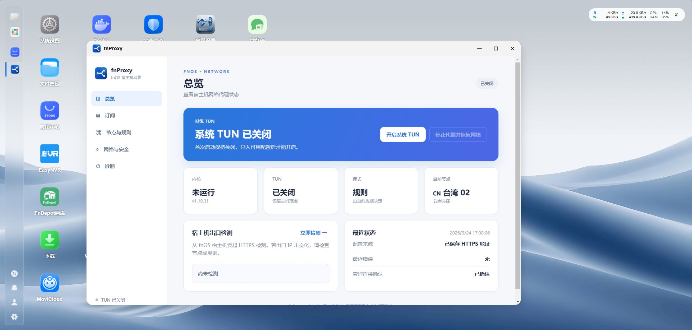
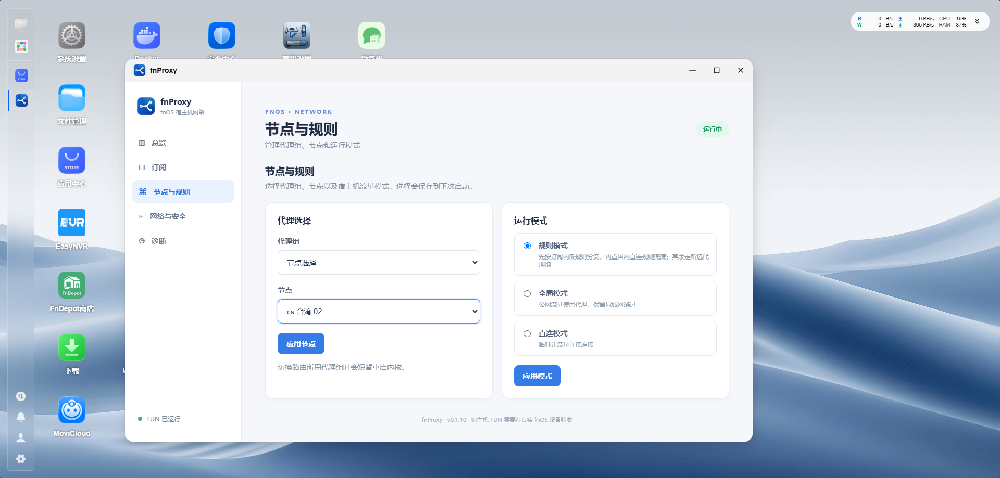
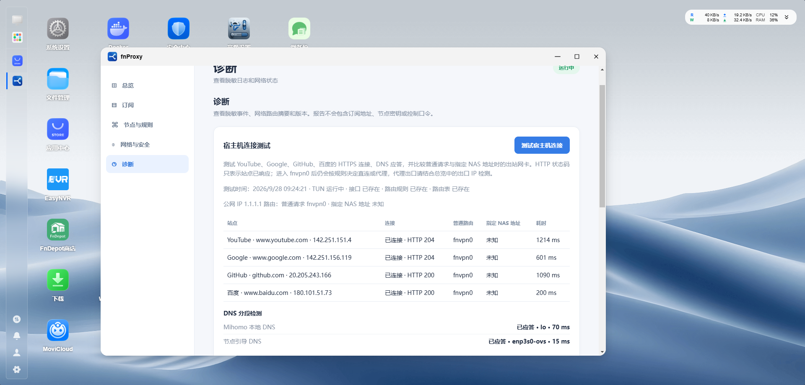

# fnProxy


**飞牛 fnOS / 飞牛 NAS 宿主机代理管理器。**fnProxy 是基于 Mihomo 的原生 FPK 应用，通过 TUN 管理 NAS 主机网络。支持导入 Clash/Mihomo YAML 订阅、切换代理节点、规则分流、全局或直连模式，以及宿主机连接诊断。首次启动不修改网络；管理员导入有效配置并主动开启后才建立 TUN。

fnProxy is a native **fnOS NAS host proxy manager** powered by **Mihomo TUN**. It imports Clash/Mihomo YAML subscriptions and provides node selection, rule-based routing, connection tests, and network recovery.

[下载 x86 FPK 安装包](https://github.com/WhitlockXD/fnProxy/releases/tag/v0.1.10) · [查看实机截图](#fnos-实机截图) · [测试与限制](docs/TESTING.md)

## fnOS 实机截图

以下截图由用户在 fnOS 上运行 fnProxy v0.1.10 时提供。连接测试显示四个站点有 HTTPS 响应，普通请求的路由指向 `fnvpn0`；截图本身不能证明每条规则实际使用的代理出口。

### 总览与系统 TUN



### 代理节点与规则模式



### 宿主机连接诊断



**当前交付状态：** 用户提供的 v0.1.10 实机截图显示应用界面、TUN 运行状态、四站点连接与 DNS 检测结果。旧版曾出现系统 DNS 超时，后续版本已调整 DNS 路径；宿主机代理出口、规则命中、升级和卸载恢复仍需完整验收。[测试记录](docs/TESTING.md)列出了待验证项目。

## 目录

| 路径 | 作用 |
| --- | --- |
| `cmd/fnvpn` | 管理服务、网关 API、Mihomo 生命周期与恢复逻辑 |
| `internal/app` | 订阅解析、输入校验与配置生成 |
| `web` | 窄屏和暗色主题中文桌面窗口 |
| `packaging` | fnOS 权限、生命周期脚本、桌面入口 |
| `scripts` | 图标、跨架构构建、Windows 归档权限修正 |
| `dist` | 构建出的 FPK（构建后生成） |
| `licenses` | 第三方许可证 |

## 架构与安全边界

fnOS 统一网关先检查登录态，然后经 `app.sock` 转发到非特权网页进程。网页进程要求 `X-Trim-Isadmin: true`、用户 ID、JSON 与自定义请求标记，并在浏览器提供来源站点信息时拒绝跨站写入；同时通过 Unix Socket 凭据检查网关进程 UID。根权限管理组件通过 `helper.sock` 只接受应用用户或 root 的固定操作；Mihomo 控制 API 仅监听 `127.0.0.1:19091`，使用随机密钥。网页无法提交任意系统命令或自定义 TUN 规则。

FPK 的网关 UID 默认设为 `0`，Socket 为 `0600`。**目标 fnOS 网关工作进程的实际 UID 尚未核验。**若目标系统使用其他 UID，需要在目标机核实该 UID 后，通过受控启动环境设置 `FNVPN_GATEWAY_UID` 并重新验收；当前包在这种系统上会拒绝访问，不会放宽 Socket 权限。官方[统一网关文档](https://developer.fnnas.com/docs/core-concepts/gateway-registration)说明了登录态和用户 Header，但没有承诺网关工作进程的 UID。

根组件运行 Mihomo 以获得 TUN 权限；网页进程使用 fnOS 应用用户。开启前检查 `/dev/net/tun`、IPv4 默认路由、IPv6 默认路由、系统 DNS、专用路由表、TUN 接口和本地端口，并在应用私有目录保存启用前的路由、策略规则与 DNS 快照。配置通过 Mihomo `-t` 检验后才启动。启动后的 30 秒内，网页必须通过网关返回确认，否则自动停止并清理应用专用状态。内核意外退出，或运行中新增 IPv6 默认路由、DNS 变为私有地址时也会执行恢复。应用不改写 `/etc/resolv.conf`，不清空系统防火墙规则；第一版没有启用 Mihomo `auto-redirect`。

## 支持的配置

- URL 必须为 HTTPS 标准端口、直连可下载的 Clash/Mihomo YAML。请求使用 `clash.meta` 客户端标识；禁止重定向、非公网下载目标，限制 2 MiB 和超时；下载时不使用系统代理环境变量。
- 本地文件支持包含 `proxies` 列表的 YAML；提取节点、`select` 类型代理组与可校验的内嵌 `rules`。端口无效的节点会跳过并在导入结果中显示数量；Hysteria2 的有效 `ports` 端口跳跃配置可以替代单个 `port`。支持域名、IP-CIDR、`GEOSITE,cn`、`GEOIP,CN` 等常用规则，最多采用 5000 条；需要外部 `rule-providers` 的规则、进程规则、`MATCH` 等暂时跳过。TUN、DNS、外部控制器和其他顶层设置不会进入最终配置。
- 规则模式先将局域网和私有地址直连，再按订阅内嵌规则的顺序分流；内置国内域名集和国内 IP 段作为兜底，其余公网流量交给所选代理组。订阅规则的 `DIRECT`、`REJECT` 保留；其余代理目标统一指向应用当前选择的代理组。导入页显示采用和跳过的规则数量。国内识别取决于随包固定的规则数据，不能保证每个网站都准确归类；全局模式和直连模式遵循各自模式。
- 纯节点链接、base64 链接订阅、仅 `proxy-providers` 的文件和其他第三方格式当前不支持。节点类型由解析器白名单和内核 `-t` 校验共同决定。
- 局域网、私有地址、回环、链路本地默认排除；代理服务器当前解析到的 IP 也在启动前排除。规则模式命中的国内域名使用直连 DNS，其余普通 DNS 上游按规则经所选代理组访问；直连模式改用直连 DNS。节点域名使用独立的 `223.5.5.5` 引导 DNS，并将该地址从 TUN 路由排除。系统 DNS 若指向本地或私有地址会拒绝开启，因为此类请求可能绕过 TUN；当前版本不会改写系统 DNS。IPv6 默认路由存在时也会拒绝开启。Docker、其他局域网设备、应用中心等流量没有覆盖承诺。

## 构建

在 Windows PowerShell 中准备 Go、Python 3 + Pillow 与官方 `fnpack 1.2.3`。脚本优先使用 `.tools/go/bin/go.exe` 和 `.tools/fnpack.exe`，否则使用 PATH 中的工具。Mihomo 固定为 `v1.19.31`，国内分流数据固定到指定提交；脚本逐一核对 SHA-256。下载来源与许可见[第三方声明](THIRD_PARTY_NOTICES.md)。

```powershell
powershell -NoProfile -ExecutionPolicy Bypass -File scripts/build.ps1
```

默认构建结果为 `dist/fnproxy_0.1.10_x86.fpk` 和 `dist/SHA256SUMS.txt`。脚本使用官方 `fnpack build`，修正 Windows 打包时遗失的 Linux 可执行位，保持 FPK 外层 gzip 格式并更新归档校验值。FPK 的内部应用标识仍为 `fnvpn`，使旧安装可原位升级并保留配置。桌面入口引用版本化图标文件；应用中心图标由 FPK 根目录的 `ICON.PNG` 和 `ICON_256.PNG` 提供。fnOS 可能缓存应用中心图标，升级后若仍显示旧图标，先强制刷新 fnOS 页面；不要在未备份订阅及设置前卸载应用。发布前要在真实 fnOS 测试机通过应用中心手动安装并完成[验收记录](docs/TESTING.md)。

## 使用与恢复

安装后从桌面打开「fnProxy」，导入订阅 URL 或本地 YAML，选择节点，点击「开启系统 TUN」，随后在总览页执行宿主机出口检测，在诊断页测试四个站点的连接与出站网卡。切换配置先在候选文件运行内核语法校验；更新失败继续保留原配置。点击「停止代理并恢复网络」或「一键恢复网络」可清理本应用管理的 TUN、专用策略路由和路由表。

若页面已无法打开，可在设备本地控制台以 root 执行应急恢复（正常使用不需要命令行）：

```sh
TRIM_APPDEST=/var/apps/fnvpn/target TRIM_PKGVAR=/var/apps/fnvpn/var \
  /var/apps/fnvpn/target/bin/fnvpn recover
```

恢复命令只处理带本应用标记的 `fnvpn0` 与路由表 `19091`。应用中心停止或卸载会调用同一恢复逻辑。存储路径按目标设备实际安装位置由 fnOS 环境变量提供，脚本中没有写死数据卷。

## 当前限制

真实 fnOS 上的网关进程 UID、Mihomo TUN 参数与内核／iptables 后端、管理页面和 SMB/NFS 可达性均待实测。出口检测只显示宿主机发起的公网 IP，不单独证明每一条规则或 DNS 请求的路径。高可用、多网卡、动态代理地址变化、Docker 流量和 IPv6 尚未通过验收。

本仓库代码以 GPL-3.0 发布。打包的 Mihomo `v1.19.31` 采用其对应标签的 GPL-3.0 许可；YAML 解析库采用 MIT/Apache 双许可。详情和完整许可证在[第三方声明](THIRD_PARTY_NOTICES.md)。
